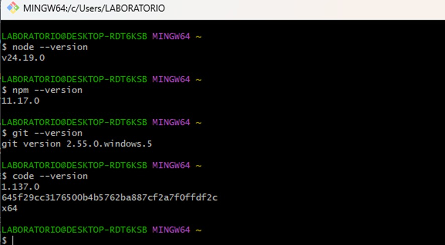
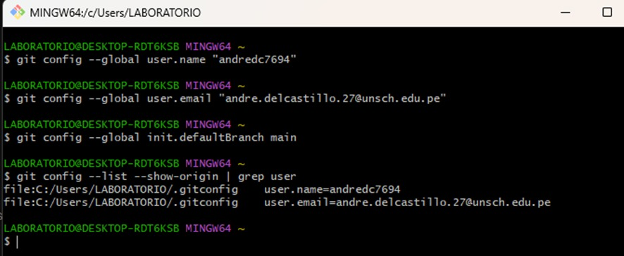

# Guía 01 - Arquitectura de Software (IS-488)

Estudiante: Andre Yesua Del Castillo Cordero
Docente: Ing. Lizbeth Jaico Quispe
Curso: Arquitectura de Software - IS-488 (Semestre 2026-II)

## Descripción del curso
El curso de Arquitectura de Software enseña la planificación, estructura y organización de alto nivel de un sistema informático antes de comenzar a programar. Funciona como el plano maestro de una construcción

## Mis expectativas
Espero aprender el uso correcto y eficiente de git, poder entregar un buen trabajo finla

## Capturas
### Verificación de versiones (Paso 1)

### Estructura de carpetas (Paso 4)

